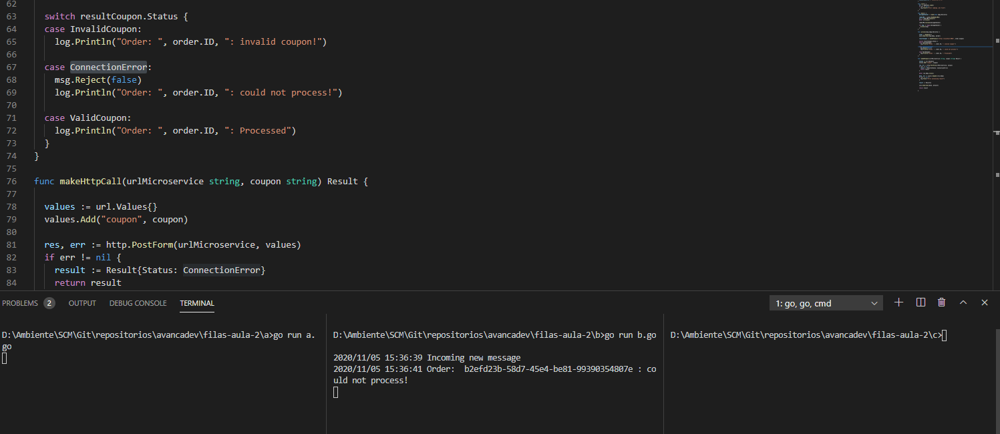
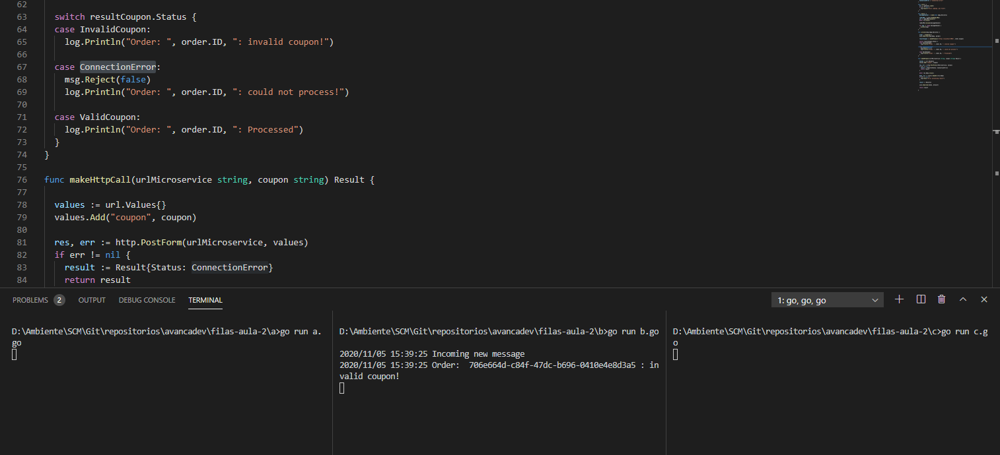
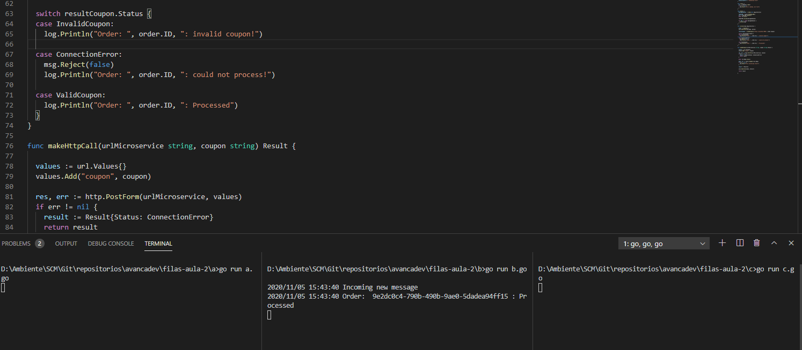

# Instruções

## RabbitMQ

- Criar os exchanges:
  - "orders_ex"
  - "dlx"

- Criar as queues com os seus respectivos argumentos:
  - "orders"
    - x-dead-letter-exchange:	dlx
  - "orders_dlq"
    - x-dead-letter-exchange: orders_elx
    - x-message-ttl: 3000

- Realizar os seguintes binds:
  - "orders_ex" => "orders"
  - "dlx" => "orders_dlq"

## Evidências

### ConnectionError

### InvalidCoupon

### ValidCoupon

